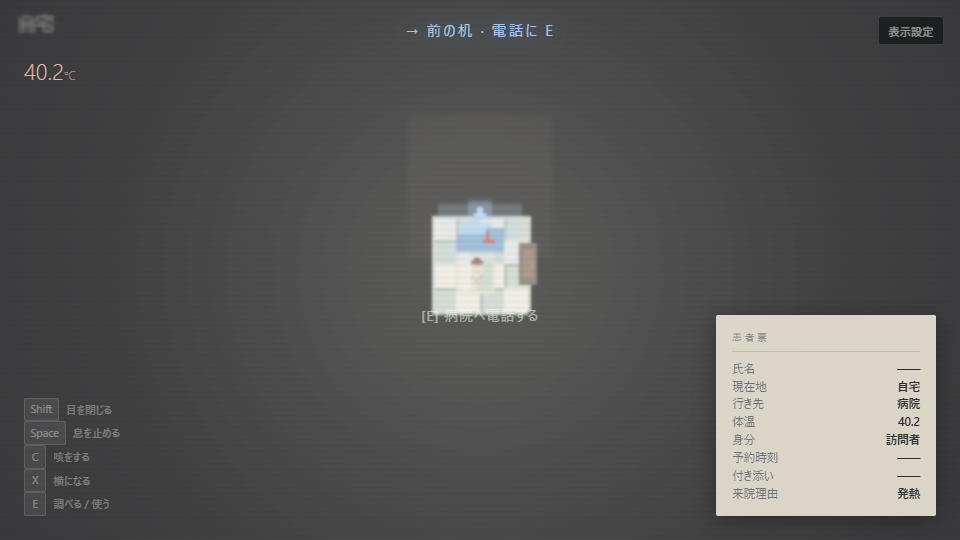

# FEVER

**病院へ行く。**

一人称・非戦闘型の発熱巡礼アドベンチャー。3D版（Three.js）と 2D版（ドット絵）の両方がプレイでき、[GitHub Pages](https://jim-auto.github.io/FEVER/) で公開しています。

[](https://jim-auto.github.io/FEVER/index-2d.html)

*2D版（320×180 ドット絵）— 六畳間から病院へ*

## コンセプト

世界はランダムに狂っているのではない。一つだけ間違った前提があり、街全体がそれを厳密かつ合理的に運用している。プレイヤーは異常を否定するのではなく、観察し、理解し、利用し、その論理へ適応していく。

## 操作

### 3D版

| キー | 身体アクション |
|------|----------------|
| WASD | 移動 |
| マウス | 視点 |
| Shift（長押し） | 目を閉じる — 未観測の場所を書き換える |
| Space | 息を止める |
| C | 咳をする |
| X | 横になる |
| E | 調べる / 使う |

### 2D版（ドット絵 · 見下ろし）

| キー | 身体アクション |
|------|----------------|
| WASD | 移動 |
| Shift（長押し） | 目を閉じる |
| Space | 息を止める（目を閉じているときは目を開ける） |
| C | 咳をする |
| X | 横になる |
| E | 調べる / 使う |

モバイルでは仮想ジョイスティック + E / 目 / 息ボタンに対応。

## 開発

```bash
npm install
npm run dev          # 3D版（Three.js）
npm run dev:2d       # 2D版（ドット絵）
```

| 版 | URL |
|----|-----|
| 3D | `http://localhost:5173/` · [公開版](https://jim-auto.github.io/FEVER/) |
| 2D | `http://localhost:5173/index-2d.html` · [公開版](https://jim-auto.github.io/FEVER/index-2d.html) |

スタート画面からも相互に切り替えできます。

README 用スクリーンショットの再生成:

```bash
npm run build && npm run screenshot:2d
```

## GitHub Pages へのデプロイ

```bash
npm run build
```

`docs/` フォルダにビルド成果物が出力される。リポジトリ Settings → Pages → Source を **Deploy from branch**、フォルダを **`/docs`** に設定する。

## 現在のプレイアブル範囲（MVP 縦切りデモ）

**第一幕：自宅** — 40.2度 · 電話 · 目を閉じて扉を書き換える

**第二幕：小数点階段** — 体温 = 階数 · 水/手すりで下りる

**第三幕：赤い予定交差点** — 三解法（洗う / 緊急 / 日暮れ）

**第四幕：移動薬局「さむけ」** — 「外」を買って出口を取得 · 薬で発熱層切替

**第五幕：巨大看護師通り** — 影の間を通過

**フィナーレ：病院の目撃** — 歩行病院 · 電話 · MVP エンディング

目安プレイ時間：30〜45分

## 技術スタック

- [Three.js](https://threejs.org/) — 3D版
- Canvas 2D — 2D版（320×180 ドット絵、整数スケール）
- [Vite](https://vitejs.dev/)

## ライセンス

Private / TBD
